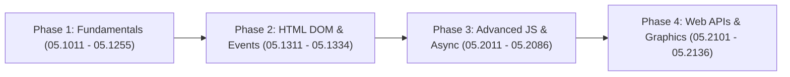

# JavaScript 196 Lessons - Hands-on Practice & Learning Guide

แผนการเรียนรู้และประมาณการเวลาสำหรับการทดลองทำตาม (Hands-on Practice) ทั้ง 196 บทเรียนในไดเรกทอรี `JS-2026/`

---

## ⏱️ 1. ประเมินเวลาต่อบทเรียน (Average Time per Lesson)

### 📘 หมวด JavaScript Basic (119 บทเรียน)
- **ขอบเขตเนื้อหา**: ไวยากรณ์พื้นฐาน, Variables, Data Types, Operators, Loops, Functions, Arrays, Objects, DOM manipulation และ Events
- **เวลาเฉลี่ย**: **15 - 25 นาที / บทเรียน** (อ่านเนื้อหา + พิมพ์โค้ดตาม + รันผลลัพธ์)
- **เวลารวมหมวด Basic**: ประมาณ **35 - 45 ชั่วโมง**

### 📙 หมวด JavaScript Advanced (77 บทเรียน)
- **ขอบเขตเนื้อหา**: Closures, IIFE, Prototypes, OOP, Promises, Async/Await, ES Modules, TypedArrays, Web Workers, Web APIs, Canvas และ Graphics libraries (D3, Chart.js, Plotly)
- **เวลาเฉลี่ย**: **30 - 45 นาที / บทเรียน** (วิเคราะห์ Logic + ทดลองแก้โค้ด + Debug)
- **เวลารวมหมวด Advanced**: ประมาณ **40 - 50 ชั่วโมง**

> 🎯 **เวลารวมสุทธิทั้งหมด**: ประมาณ **80 - 100 ชั่วโมง**

---

## 📅 2. แผนตารางการเรียนรู้ (Study Schedule Options)

| รูปแบบการเรียน | เวลาเรียนต่อวัน/สัปดาห์ | ระยะเวลาที่ใช้จนจบ (196 บท) | คำแนะนำ |
| :--- | :--- | :--- | :--- |
| **เรียนทุกวัน (Daily Study)** | 2 ชั่วโมง / วัน | **~40 - 50 วัน** (ประมาณ 1.5 เดือน) | สะสมวันละ 3-4 บทเรียน พร้อมทดลองดัดแปลงโค้ด |
| **เรียนพาร์ทไทม์ (Part-Time)** | 10 ชั่วโมง / สัปดาห์ | **~8 - 10 สัปดาห์** (ประมาณ 2 เดือน) | เหมาะสำหรับผู้ที่ทำงานประจำ เรียนช่วงวันหยุด |
| **เรียนแบบเข้มข้น (Bootcamp Mode)** | 5 - 6 ชั่วโมง / วัน | **~15 - 20 วัน** (ประมาณ 3 สัปดาห์) | เน้นลุยต่อเนื่อง วันละ 10-12 บทเรียน |

---

## 🗺️ 3. แผนการเรียน 4 ระยะ (4-Phase Learning Roadmap)

### 📍 Phase 1: Core Fundamentals (`05.1011` - `05.1255`)
- **โฟกัส**: Syntax, Variables (`let`/`const`), Operators, Data Types, Control Flows (`for`/`while`), Functions, Arrays, Objects, Scope & Hoisting
- **เป้าหมาย**: เขียน logic พื้นฐานและเข้าใจโครงสร้างข้อมูลหลักใน JavaScript

### 📍 Phase 2: HTML DOM & Events (`05.1311` - `05.1334`)
- **โฟกัส**: DOM Elements Selection, Content/CSS Modification, Mouse/Keyboard Events, Event Listeners
- **เป้าหมาย**: ควบคุมและสร้างการตอบสนองบนหน้าเว็บ (Interactive Web Applications)

### 📍 Phase 3: Advanced JS & Asynchronous (`05.2011` - `05.2086`)
- **โฟกัส**: Callbacks, `this` keyword, Closures, OOP/Classes, JSON, Promises, Async/Await, Event Loop, ES Modules
- **เป้าหมาย**: เข้าใจการทำงาน asynchronous และโครงสร้างโค้ดระดับโปรดักชัน

### 📍 Phase 4: Web APIs & Data Visualization (`05.2101` - `05.2136`)
- **โฟกัส**: Navigation, Location, Cookies, Web Storage (LocalStorage/SessionStorage), Fetch API, Canvas 2D, Chart.js, D3.js, Plotly
- **เป้าหมาย**: ดึงข้อมูลจากภายนอก จัดเก็บข้อมูลบน Browser และแสดงผลข้อมูลเชิงลึกด้วยกราฟิก

---

## 💡 4. คำแนะนำสำหรับการเรียนรู้แบบ Hands-on Practice

1. **อย่าอ่านอย่างเดียว ให้พิมพ์ตาม (Type, Don't Copy-Paste)**
   - การพิมพ์โค้ดเองช่วยสร้างกล้ามเนื้อความจำ (Muscle Memory) และสังเกตไวยากรณ์ได้ดีกว่า
2. **ทดลองเปลี่ยนค่าตัวแปรและดูผลลัพธ์ (Experiment & Break Things)**
   - ลองเปลี่ยนเงื่อนไข `if-else` หรือเปลี่ยนโครงสร้างข้อมูลในตัวแปร เพื่อดูว่าเกิด Error แบบไหนและแก้ไขอย่างไร
3. **ใช้ DevTools Console เป็นประจำ**
   - ใช้ `console.log()` ตรวจสอบค่าตัวแปรและชนิดข้อมูล (`typeof`) ในแต่ละขั้นตอน
4. **บันทึกความก้าวหน้า**
   - สรุปสั้นๆ ในแบบฉบับตนเอง หรือทำ Checklist บทเรียนที่ผ่านแล้วในไฟล์ `acp-js.php`
